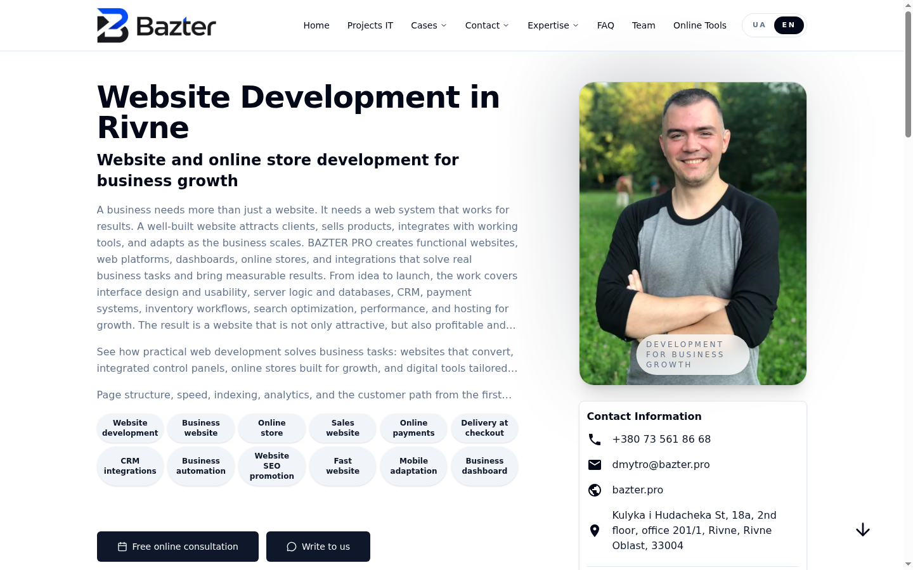

# BAZTER PRO

**Web development studio & DevSecOps tooling** — [bazter.pro/en](https://bazter.pro/en/)

## Homepage preview

*Screenshot: [bazter.pro/en](https://bazter.pro/en/) — June 2026*

## What we do

BAZTER PRO builds business websites, e-commerce stores, CRM integrations, and long-term support — with a strong focus on **architecture**, **performance**, **technical SEO**, and **reliable delivery**.

| Service | Link |
|---|---|
| Website development | [bazter.pro/en/rozrobka-saytiv](https://bazter.pro/en/rozrobka-saytiv/) |
| E-commerce | [bazter.pro/en/internet-magazyny](https://bazter.pro/en/internet-magazyny/) |
| Integrations & CRM | [bazter.pro/en/integraciyi](https://bazter.pro/en/integraciyi/) |
| Website support | [bazter.pro/en/pidtrymka-saytu](https://bazter.pro/en/pidtrymka-saytu/) |
| Portfolio / case studies | [bazter.pro/websites](https://bazter.pro/websites/) |
| Free DevSecOps tools | [bazter.pro/tools](https://bazter.pro/tools/) |

## Our team

### Dmytro Bazter — Founder & Lead Developer
Full-stack web architect: product development, technical SEO, automation, infrastructure, and scalable delivery.

- Email: [dmytro@bazter.pro](mailto:dmytro@bazter.pro)
- Telegram: [@bazterpro](https://t.me/bazterpro)

### Maria C. — Content Manager
Client communication, SEO execution, audits, content planning, and coordination between marketing and development.

- Email: [Maria@bazter.pro](mailto:Maria@bazter.pro)
- Telegram: [@Mariiamyro](https://t.me/Mariiamyro)

**Meet the full team:** [bazter.pro/en/team](https://bazter.pro/en/team/)

## Why clients work with us

- Clear commercial pages with search intent and internal linking
- Fast static/SSR delivery, monitoring, and post-launch support
- Practical tooling for SSL, IP security, screenshots, and ops workflows
- Transparent contact paths: phone, Telegram, Viber, email

## Contact

- **Website:** [https://bazter.pro/en/](https://bazter.pro/en/)
- **Location:** Rivne, Ukraine — [map & office](https://bazter.pro/en/location/)
- **FAQ:** [bazter.pro/faq](https://bazter.pro/faq/)

---

© BAZTER PRO. This repository is a public project overview and marketing page for [bazter.pro](https://bazter.pro/).
